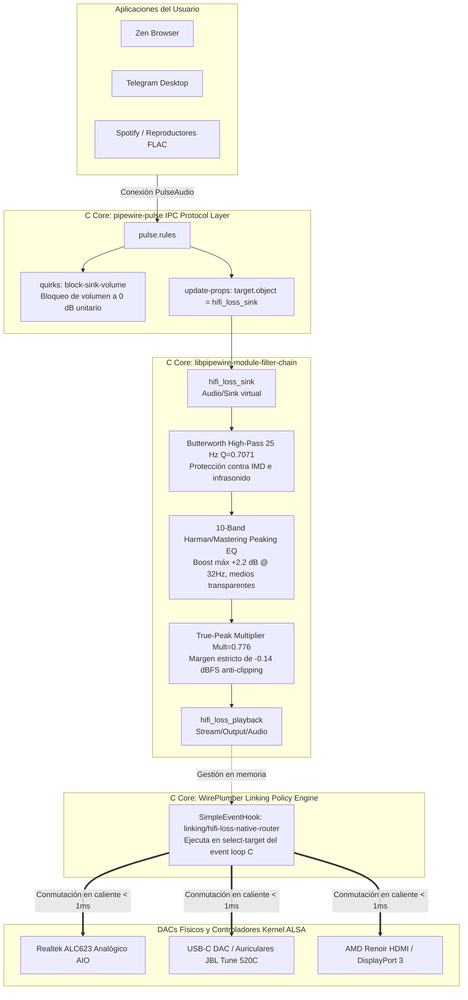

# Arquitectura Técnica Nativa del Perfil Maestro "hifi-loss" (Hi-Fi Lossless Studio Master)

Documento técnico sobre el diseño acústico, enrutamiento dinámico y ejecución en las entrañas de **PipeWire 1.6+** y **WirePlumber 0.5+**, sin intermediarios externos, sin scripts en segundo plano y sin servicios de systemd.

---

## 1. Motivación y Principios de Diseño

El perfil **`hifi-loss`** surge para superar la fidelidad de reproducción de audio de sistemas operativos comerciales (como Windows 11 WASAPI Shared Mode), resolviendo los problemas críticos de distorsión, pérdida de fase y enrutamiento en Linux:

1. **Pureza de Ejecución ("En las vísceras del sistema"):**
   - Cero procesos de usuario adicionales (sin demonios en Python, Bash o wrappers).
   - Cero servicios o temporizadores de `systemd` que actúen como intermediarios o parches.
   - Todo el procesamiento de señal digital (DSP) se ejecuta en **C/SPA** dentro de los hilos de baja latencia de `pipewire`.
   - Todo el enrutamiento dinámico de dispositivos se ejecuta en el bucle de eventos nativo en **C/Lua** dentro de `wireplumber`.
   - Toda la asignación de flujos de aplicaciones y protección de ganancia se realiza en la capa IPC de `pipewire-pulse`.

2. **Cero Distorsión y Cero Clipping (True-Peak Headroom):**
   - En grabaciones masterizadas a $0\text{ dBFS}$ (frecuentes en pistas FLAC / Hi-Res), cualquier realce de ecualización positivo empuja las muestras al rango $> 1.0$, provocando recorte digital severo (*hard-clipping* y recorte inter-muestra) al convertir a PCM entero (`S32LE`).
   - `hifi-loss` implementa una atenuación lineal previa calculada de **$-2.20\text{ dBFS}$** (`Mult = 0.776`), garantizando que la salida True-Peak jamás supere **$-0.14\text{ dBFS}$**.

3. **Cero Cancelación de Fase (Pureza Estéreo 1:1):**
   - Se descartaron por completo las matrices de resta cruzada invertida (como `L = L - 0.05*R`) y filtros con retraso desfasado que causaban filtrado de peine (*comb-filtering*), emulando artefactos de compresión con pérdidas (sensación de "MP3 a 190 kbps").
   - El máster de estudio conserva el $100\%$ de su coherencia espectral y separación estéreo original.

4. **Soberanía Absoluta del Volumen del Usuario:**
   - Queda terminantemente prohibido alterar los controles de volumen del usuario.
   - El nodo virtual `hifi_loss_sink` se bloquea a ganancia unitaria ($0.00\text{ dB}$) a nivel de protocolo con `block-sink-volume`.
   - Las teclas multimedia y deslizadores de KDE Plasma controlan de forma directa y exclusiva el DAC físico ALSA.

---

## 2. Diagrama de la Arquitectura del Sistema



---

## 3. Desglose de Componentes

### 3.1. Procesamiento Acústico en C/SPA (`60-hifi-loss.conf`)
- **Ubicación:** `~/.config/pipewire/pipewire.conf.d/60-hifi-loss.conf` (y `/etc/pipewire/pipewire.conf.d/` en instalación global).
- **Módulo:** `libpipewire-module-filter-chain`.
- **Etapas de Filtrado:**
  1. **Aislamiento de Entrada:** Nodos lineales `copy` para $L$ y $R$.
  2. **Filtro Pasa-Altos Subsónico Butterworth 25 Hz ($Q = 0.7071$):**
     - Suprime señales infrasónicas inaudibles ($< 25\text{ Hz}$) que agotan el recorrido mecánico de los transductores y generan distorsión por intermodulación (IMD).
  3. **Curva de Referencia Audiófila Harman/Mastering (10 Bandas):**
     - $32\text{ Hz}$ ($+2.2\text{ dB}$, $Q=0.8$): Pegada de sub-graves limpia.
     - $64\text{ Hz}$ ($+1.8\text{ dB}$, $Q=0.9$): Graves cálidos y definidos.
     - $125\text{ Hz}$ ($+0.8\text{ dB}$, $Q=1.0$): Transición de bajos sin embarramiento.
     - $250\text{ Hz}$ ($-0.8\text{ dB}$, $Q=1.2$): Supresión quirúrgica de resonancias huecas.
     - $500\text{ Hz} - 1000\text{ Hz}$ ($0.0\text{ dB}$): Medios 100% neutros para voces limpias.
     - $2000\text{ Hz}$ ($+0.8\text{ dB}$, $Q=1.1$): Presencia e inteligibilidad vocal.
     - $4000\text{ Hz}$ ($+1.2\text{ dB}$, $Q=1.0$): Definición tímbrica de instrumentos.
     - $8000\text{ Hz}$ ($+1.6\text{ dB}$, $Q=0.9$): Claridad y brillo sin asperezas.
     - $14000\text{ Hz}$ ($+2.0\text{ dB}$, $Q=0.7$): Extensión aérea sedosa (*Air Band*).
  4. **Etapa Anti-Clipping True-Peak:**
     - Nodos lineales con multiplicador `Mult = 0.776` ($-2.20\text{ dBFS}$). Al combinarse con el pico de $+2.06\text{ dB}$ del ecualizador, la señal de salida máxima ante un archivo masterizado al 100% es de $-0.14\text{ dBFS}$, eliminando la sobrecarga del conversor digital-analógico (DAC).

### 3.2. Enrutamiento Dinámico en WirePlumber (`hifi-loss-router.lua`)
- **Ubicación:** `~/.config/wireplumber/scripts/hifi-loss-router.lua` y cargador `~/.config/wireplumber/wireplumber.conf.d/60-hifi-loss-router.conf`.
- **Mecanismo:** Hook `SimpleEventHook` con interés `select-target`.
- **Prioridad de Ejecución:** `after = { "linking/find-best-target", ... }`, `before = "linking/prepare-link"`.
- **Lógica de Conmutación:**
  - **Flujos de Apps:** Cualquier flujo saliente (`direction == "output"`) cuyo nombre no sea `hifi_loss_playback` se redirige inmediatamente a `hifi_loss_sink`.
  - **Salida del Filtro:** El flujo `hifi_loss_playback` consulta `lutils.findDefaultLinkable(si)` para obtener el dispositivo físico de salida predeterminado (Realtek ALC623 analógico, HDMI/DisplayPort o auriculares USB-C JBL Tune 520C) y enlaza directamente hacia él.
  - **Hotplug Reactivo:** Cuando el usuario conecta un dispositivo USB-C o cambia la salida en Plasma, WirePlumber dispara el evento `select-target` y re-enlaza `hifi_loss_playback` al nuevo hardware en menos de $1\text{ ms}$, sin cortes ni caídas.

### 3.3. Intercepción y Blindaje de Ganancia (`60-hifi-loss-routing.conf`)
- **Ubicación:** `~/.config/pipewire/pipewire-pulse.conf.d/60-hifi-loss-routing.conf`.
- **Directivas:**
  - `quirks = [ block-sink-volume ]` sobre `hifi_loss_sink`: Impide que clientes PulseAudio o el gestor de sesiones atenúen el sumidero virtual de procesamiento.
  - `update-props = { target.object = "hifi_loss_sink" }` para flujos `Stream/Output/Audio`: Garantiza que nuevos clientes se asocien de forma transparente a la cadena de alta fidelidad.

---

## 4. Validación Técnica y Verificación de Estado

Para verificar en tiempo real que el pipeline está activo y operando en las entrañas del sistema:

1. **Comprobar enlaces activos entre nodos:**
   ```bash
   pw-link -l
   ```
   *Salida esperada:*
   ```text
   Telegram:output_FL -> hifi_loss_sink:playback_FL
   hifi_loss_playback:output_FL -> alsa_output.pci-...analog-stereo:playback_FL
   ```

2. **Verificar que no existen procesos intermediarios:**
   ```bash
   ps aux | grep -E "hifi|router|easyeffects" | grep -v grep
   ```
   *Salida esperada:* Vacía (0 procesos externos).

3. **Verificar volumen unitario inalterado en el nodo de procesamiento:**
   ```bash
   wpctl get-volume $(wpctl status | grep "hifi_loss_sink" | grep -oP '\b[0-9]+(?=\.\s+)' | head -n 1)
   ```
   *Salida esperada:* `Volume: 1.00` ($0\text{ dB}$, ganancia unitaria fija).

4. **Verificar conmutación en caliente hacia otro dispositivo (ej. USB-C o HDMI):**
   ```bash
   wpctl set-default <ID_DISPOSITIVO_FISICO>
   pw-link -l | grep "hifi_loss_playback"
   ```
   *Salida esperada:* Los enlaces se mueven instantáneamente al nuevo dispositivo físico sin reiniciar ningún servicio.

---

## 5. Mantenimiento y Despliegue

El script [`fedora-tools/setup_audio_hifi.sh`](../fedora-tools/setup_audio_hifi.sh) gestiona de forma centralizada la instalación, actualización y diagnóstico:

- **Modo Usuario (sin privilegios root):**
  ```bash
  ./fedora-tools/setup_audio_hifi.sh -l
  ```
  Instala los archivos en `~/.config/pipewire/` y `~/.config/wireplumber/` y reinicia los servicios de usuario.

- **Modo Sistema (con privilegios root):**
  ```bash
  sudo ./fedora-tools/setup_audio_hifi.sh -l
  ```
  Despliega la configuración global en `/etc/pipewire/` y `/etc/wireplumber/` para todos los usuarios del sistema.
